# 🛒 淘宝用户行为分析与推荐系统 (User-Based & Item-Based CF)

> "因为不仅是你妈，我也觉得你缺条秋裤。" —— 协同过滤算法

[](https://www.python.org/)
[](https://nature.com)
[]()

## 📖 这是一个什么项目？

简单来说，这是一个 **“偷窥”**（划掉）**分析** 淘宝用户行为，并试图以此掏空他们钱包的 Python 项目。

我们集成了 **两大核心推荐算法**，总有一款适合你：

1. **基于用户的协同过滤 (User-Based CF)**：
   * **逻辑**：你和隔壁老王都买了 A、B，老王还买了 C，所以你也应该买 C。
   * **口号**：*“跟着大佬买，别墅靠大海。”*
2. **基于物品的协同过滤 (Item-Based CF)**：
   * **逻辑**：喜欢买 A 的人通常也喜欢买 B，既然你买了 A，那 B 你肯定也跑不掉。
   * **口号**：*“物以类聚，人以群分，商品也有朋友圈。”*

本项目不仅实现了推荐算法，还附带了 **“看起来可以发 SCI 顶刊”** 的数据可视化。配色骚气，字体优雅，不仅能跑，还能发朋友圈装杯。

## 📊 数据说明 (Data Description)

本项目使用的数据集包含淘宝用户的历史行为数据。我们对原始数据进行了字段映射，并筛选了核心特征用于算法建模。

### 字段映射与使用情况对照表

| 原始标签 (Raw Label) | 代码字段名 (Code Field) | 是否使用 | 用途说明 (Usage in Code) |
| :--- | :--- | :---: | :--- |
| **用户ID** | `user_id` | ✅ | **核心主键**。用于构建用户-物品交互矩阵的行索引，识别不同用户。 |
| **商品ID** | `item_id` | ✅ | **核心主键**。用于构建用户-物品交互矩阵的列索引，识别不同商品。 |
| **品牌** | `brand` | ✅ | **结果展示**。在推荐结果 CSV 中展示商品品牌信息。 |
| **品牌ID** | `brand_id` | ❌ | 暂未使用（代码中已读取但未参与逻辑运算）。 |
| **商品名称** | `item_name` | ✅ | **结果展示**。在推荐结果 CSV 中展示具体的商品名称。 |
| **商品类别** | `item_category` | ✅ | **数据分析**。用于统计“商品类别热度 Top10”以及在结果中展示。 |
| **商品类目ID** | `item_category_id` | ❌ | 暂未使用（代码中已读取但未参与逻辑运算）。 |
| **行为类型** | `behavior_type` | ✅ | **核心特征**。用于量化用户兴趣强度 (浏览=1, 收藏=2, 加购=3, 购买=4)。 |
| **时间戳** | `timestamp` | ✅ | **数据分析**。转换为日期时间格式，用于分析“用户24小时活跃度”。 |
| **售价** | `price` | ✅ | **数据分析**。用于绘制“商品价格分布图”以及在推荐结果中展示价格。 |

*(注：数据文件默认位于 `data/UserBehavior.csv`，程序会自动处理表头映射)*

## ✨ 核心功能 (Features)

* **🕵️‍♂️ 深度行为分析**：
  * 把用户的 `pv`、`fav`、`cart`、`buy` 行为翻译成人话（浏览、收藏、加购、购买）。
  * 给不同行为打分，建立“用户-商品”的感情连接矩阵。
* **🤝 双核协同过滤算法**：
  * **User-Based**：计算用户之间的“基情”指数（余弦相似度），利用 KNN 找到你的灵魂伴侣（购物搭子）。
  * **Item-Based**：计算商品之间的“CP感”（物品相似度），挖掘潜在的搭配购买需求。
  * 生成 Top-N 推荐列表，精准打击用户痛点。
* **🎨 SCI 级可视化**：
  * **拒绝直男审美**：抛弃 matplotlib 默认配色，采用 Nature/Science 同款色盘。
  * **中文无乱码**：内置核弹级字体修复方案，Windows 下也能优雅显示中文（再也不用看方块字了）。
  * **图表丰富**：
    * 📊 **用户行为类型分布**：看看大家是只看不买的“白嫖党”，还是直接下单的“土豪”。
    * 📈 **24小时活跃度**：凌晨3点还在刷淘宝的，都是有故事的人。
    * 💰 **价格分布**：99% 的商品都在你买得起的范围内（大概）。
    * 🔥 **相似度热力图**：看清用户之间（或商品之间）错综复杂的关系网。

## 🧠 算法建模详解 (Algorithm Modeling)

### 1. 基于用户的协同过滤 (User-Based CF)

本代码实现的核心思想是：**“你和谁像，就买谁买过的东西”**。它挖掘用户历史行为的相似性，找到目标用户的“邻居”，利用邻居的偏好进行预测推荐。

#### 1.0 算法流程图 (Algorithm Flowchart)

为了让你一眼看懂代码在干什么，我画了一张逻辑清晰的流程图。不要问我为什么画这么好，问就是专业。

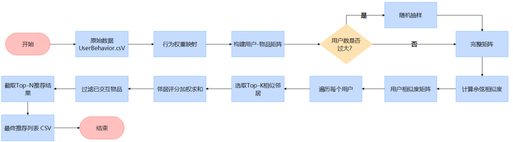

#### 1.1 用户行为量化 (Implicit to Explicit Feedback)

原始数据包含浏览、收藏、加购、购买等隐式行为。为了构建评分矩阵，首先建立行为强度映射模型。

* **代码位置**：`behavior_score` 字典
* **建模公式**：
  设用户 $u$ 对物品 $i$ 的行为类型为 $b_{ui}$，则评分 $r_{ui}$ 定义为：

  $$
  r_{ui} = \\sum w(b_{ui})
  $$

  其中权重 $w$ 映射如下：

  * 浏览 (pv) = 1
  * 收藏 (fav) = 2
  * 加购 (cart) = 3
  * 购买 (buy) = 4
* **实现细节**：如果用户对同一商品有多次相同行为，在构建矩阵时采用 `sum` 聚合，即多次浏览权重会累加，体现更强的兴趣。

#### 1.2 构建用户-物品评分矩阵 (User-Item Matrix Construction)

将长表（Log Data）转换为宽表矩阵，这是协同过滤的基础数据结构。

* **代码位置**：`build_user_item_matrix` 函数
* **数学表示**：
  构建矩阵 $R_{m \\times n}$，其中 $m$ 为用户数，$n$ 为物品数。

  $$
  R = \\begin{bmatrix}
  r_{11} & r_{12} & \\cdots & r_{1n} \\\\
  r_{21} & r_{22} & \\cdots & r_{2n} \\\\
  \\vdots & \\vdots & \\ddots & \\vdots \\\\
  r_{m1} & r_{m2} & \\cdots & r_{mn}
  \\end{bmatrix}
  $$

  矩阵极其稀疏，未交互项填充为 $0$。

#### 1.3 用户相似度计算 (User Similarity Calculation)

寻找与目标用户兴趣相似的群体。本代码采用 **余弦相似度 (Cosine Similarity)**，它衡量的是用户向量在多维空间中方向的一致性，而非距离。

* **代码位置**：`compute_user_similarity` 函数
* **核心公式**：
  设用户 $u$ 和用户 $v$ 的评分向量分别为 $\\vec{r}_u$ 和 $\\vec{r}_v$，其相似度 $sim(u,v)$ 为：

  $$
  sim(u, v) = \\cos(\\theta) = \\frac{\\vec{r}_u \\cdot \\vec{r}_v}{\\|\\vec{r}_u\\| \\|\\vec{r}_v\\|} = \\frac{\\sum_{i \\in I} r_{ui} r_{vi}}{\\sqrt{\\sum_{i \\in I} r_{ui}^2} \\sqrt{\\sum_{i \\in I} r_{vi}^2}}
  $$

  其中 $I$ 是所有物品的集合。代码直接调用 `sklearn.metrics.pairwise.cosine_similarity` 高效实现矩阵运算。

#### 1.4 评分预测与 Top-N 推荐 (Prediction & Generation)

基于相似邻居的偏好，预测目标用户对未交互物品的感兴趣程度。

* **代码位置**：`generate_recommendations` 函数
* **步骤详解**：
  1. **邻居选择**：对于目标用户 $u$，在相似度矩阵中找到相似度最高的 $K$ 个用户，构成邻居集合 $N(u)$。
  2. **加权预测**：利用邻居对物品 $i$ 的评分 $r_{vi}$，以相似度 $sim(u,v)$ 为权重进行加权平均。
  3. **过滤已交互**：排除用户历史已经产生过行为的物品。
  4. **Top-N 排序**：对预测评分降序排列，取前 $N$ 个作为最终推荐列表。

#### 1.5 可视化分析与结果展示 (Visualization & Results)

既然跑出了结果，当然要拿出来炫耀一下。以下是我们生成的分析图表：

**1. 用户行为类型分布**
看看大家是只看不买的“白嫖党”，还是直接下单的“土豪”。
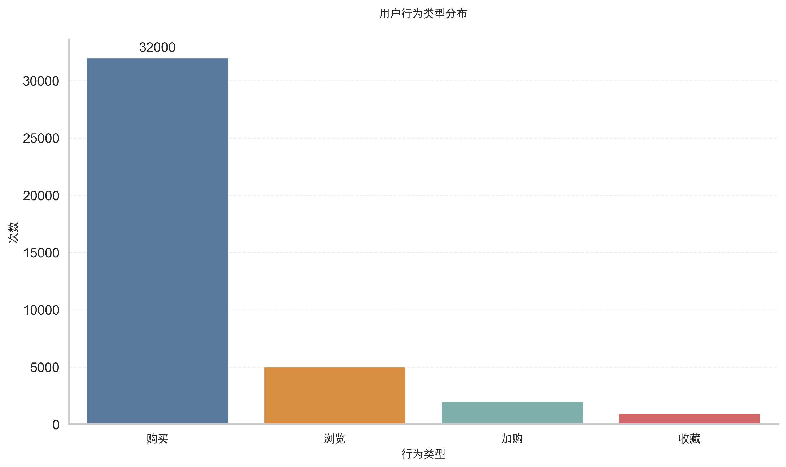
*分析：从图中可以看出，浏览行为（pv）占据了绝大多数，这符合漏斗模型。真正转化为购买的比例较低，说明用户比较挑剔（或者比较穷）。*

**2. 商品类别热度 Top10**
谁是当之无愧的“带货王”？
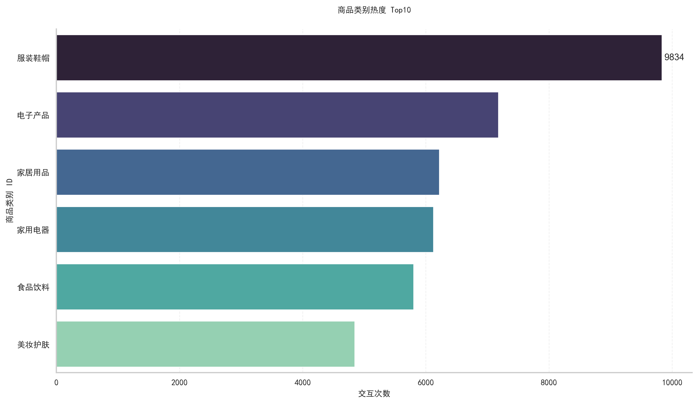
*分析：排名前列的商品类别往往是刚需或者热门快消品。如果你想做电商，照着这个榜单进货准没错（亏了别找我）。*

**3. 24小时活跃度分布**
凌晨3点还在刷淘宝的，都是有故事的人。
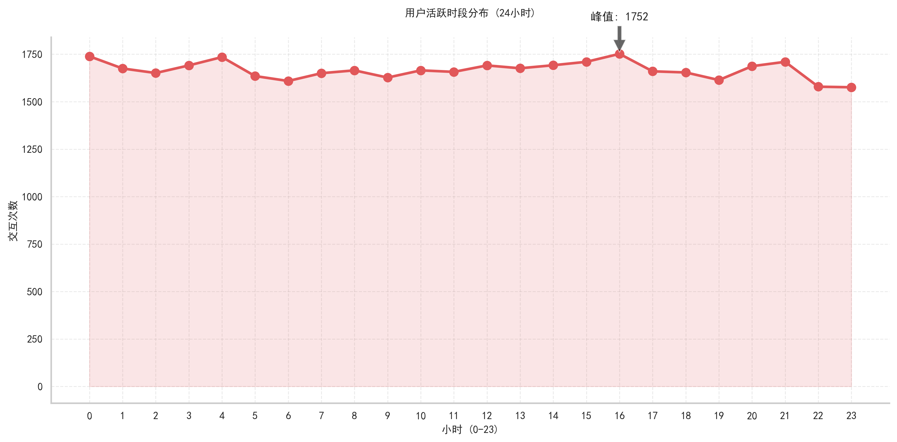
*分析：用户活跃度在晚间达到高峰（约20:00-22:00），这是典型的“睡前刷手机”综合症。营销活动如果放在这个时间段，效果应该会炸裂。*

**4. 用户活跃度分布**
二八定律诚不欺我，少数人贡献了绝大多数的点击量。
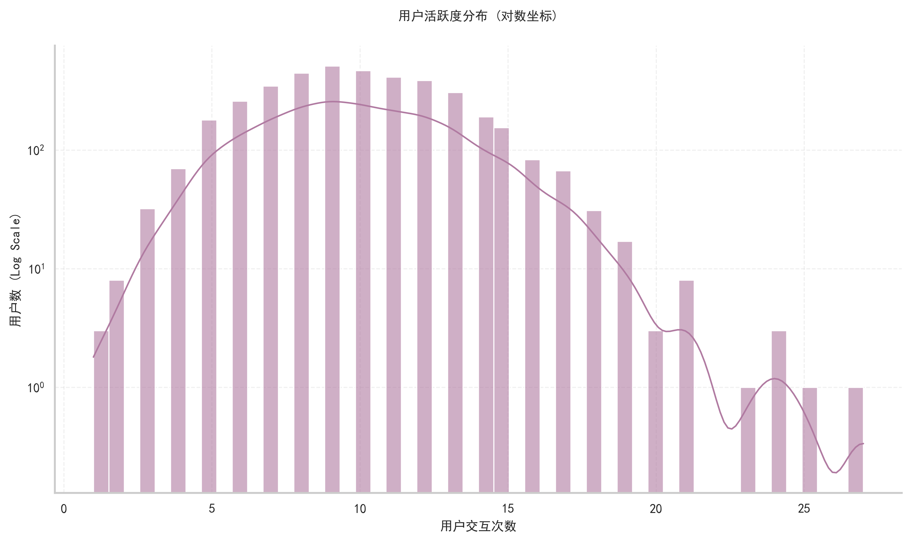
*分析：在对数坐标下，用户活跃度呈现出完美的线性下降趋势，这是标准的幂律分布（Power Law）。说明大部分用户只是偶尔逛逛，而少部分“重度成瘾患者”支撑起了整个平台的流量。*

**5. 商品价格分布 (Top 99%)**
99% 的商品都在你买得起的范围内（大概）。
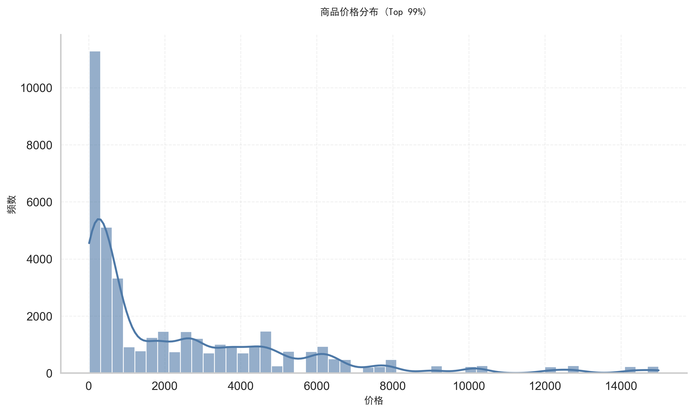
*分析：价格分布呈现明显的长尾效应，低价商品占据主导地位。毕竟大家都是普通人，几万块的东西看看就好。*

**6. 相似度热力图**
看清用户之间错综复杂的关系网。
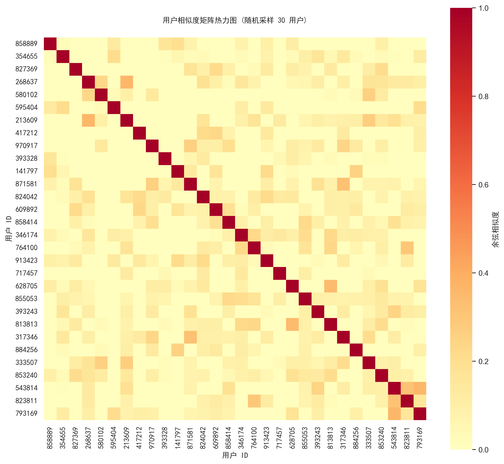
*分析：热力图中颜色较深的区域代表用户兴趣高度重合。如果发现一片红，说明这一群人的品味出奇的一致。*

**7. 推荐结果示例 (CSV)**
这就是我们为用户精心挑选的“剁手清单”。以下是部分推荐结果预览：

| user_id | item_id | rank | score  | item_name          | item_category | brand | price   |
| :------ | :------ | :--- | :----- | :----------------- | :------------ | :---- | :------ |
| 444056  | 3744636 | 1    | 0.7958 | 华为MatePad Pro... | 电子产品      | 华为  | 4415.07 |
| 444056  | 2734479 | 2    | 0.7074 | 格力微波炉P70...   | 家用电器      | 格力  | 1624.95 |
| 576877  | 3111890 | 1    | 0.8850 | 欧派浴室柜 80cm... | 家居用品      | 欧派  | 2903.45 |
| 576877  | 8033659 | 2    | 0.7837 | 宜家爱克托沙发...  | 家居用品      | 宜家  | 9036.23 |

*(注：完整结果请查看 `User_png/用户协同过滤推荐结果.csv`)*

### 2. 基于物品的协同过滤 (Item-Based CF)

核心思想是：**“喜欢这个商品的人，也喜欢那个商品”**（物以类聚）。
Item-Based CF 并非根据物品属性（如颜色、品牌）计算相似度，而是根据**用户的交互历史**来计算物品之间的相似度。

#### 2.0 算法流程图 (Algorithm Flowchart)

流程和基于用户的算法类似，但核心矩阵发生了转置。

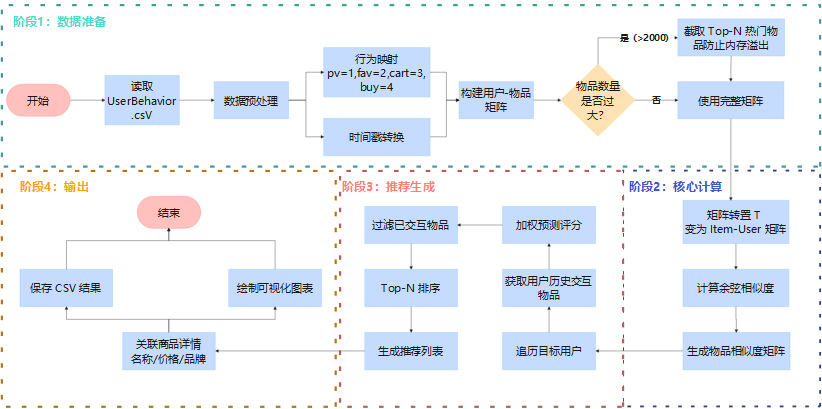

#### 2.1 物品相似度计算 (Item Similarity Calculation)

* **代码位置**：`compute_item_similarity` 函数
* **核心逻辑**：
  计算物品 $i$ 和物品 $j$ 的相似度，看这两个物品是否经常被同一个用户一起购买/浏览。

  $$
  sim(i, j) = \cos(\vec{r}_i, \vec{r}_j) = \frac{\sum_{u \in U} r_{ui} r_{uj}}{\sqrt{\sum_{u \in U} r_{ui}^2} \sqrt{\sum_{u \in U} r_{uj}^2}}
  $$

  其中 $\vec{r}_i$ 是物品 $i$ 在所有用户上的评分向量。

#### 2.2 评分预测 (Prediction)

* **代码位置**：`generate_item_based_recommendations` 函数
* **预测公式**：
  目标用户 $u$ 对未交互物品 $i$ 的预测评分 $P_{ui}$：

  $$
  P_{ui} = \\frac{\\sum_{j \\in N(i) \\cap I_u} sim(i, j) \\cdot r_{uj}}{\\sum_{j \\in N(i) \\cap I_u} |sim(i, j)|}
  $$

  这里 $I_u$ 是用户 $u$ 已经交互过的物品集合，$N(i)$ 是物品 $i$ 的相似物品集合（Top-K）。
  简单来说，就是**用你过去喜欢的物品，去投票选出你可能喜欢的其他物品**。

#### 2.3 可视化分析与结果展示 (Visualization & Results)

Item-Based 算法的分析图表保存在 `Item_png` 文件夹下。

**1. 用户行为类型分布**
虽然数据源一样，但换个配色看心情都变好了。
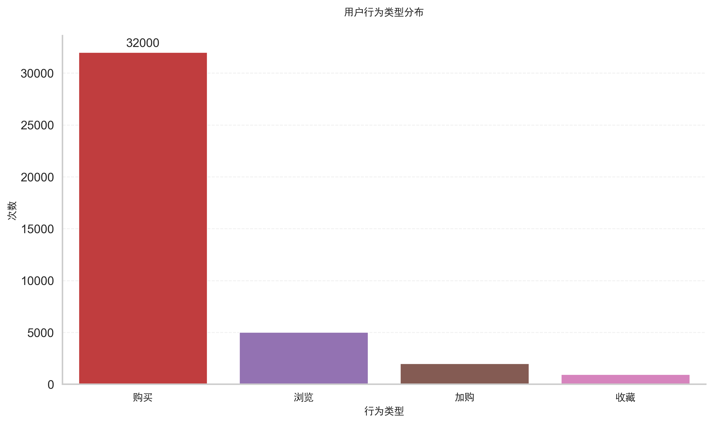
*分析：Item-Based 视角下的行为分布。依然是“只看不买”占主流，但我们更关注那些转化为“购买”的高价值行为，因为它们决定了物品之间的强关联。*

**2. 商品类别热度 Top10**
热门商品总是自带流量。
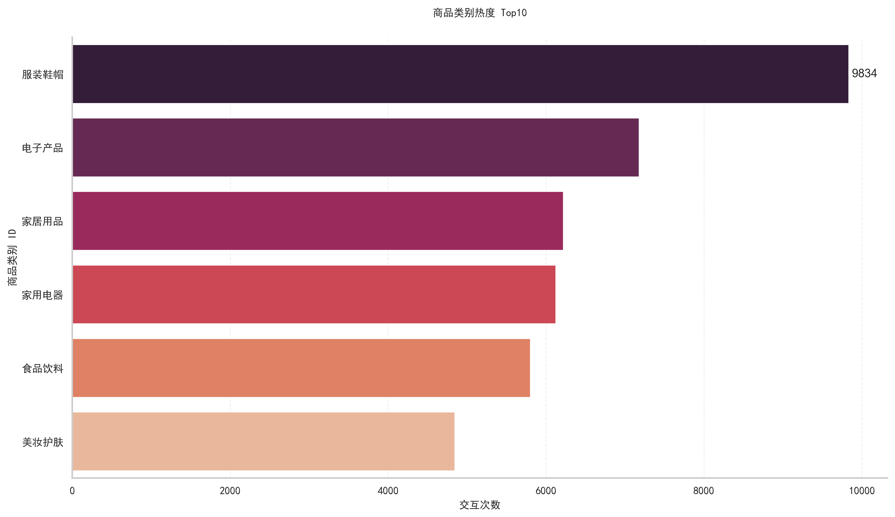
*分析：这些热门类别的商品拥有最丰富的交互数据，是 Item-Based 算法的“基石”。冷门商品由于交互少，很难计算出准确的相似度（冷启动问题）。*

**3. 用户行为小时分布**
时间就是金钱，但深夜的时间是用来剁手的。
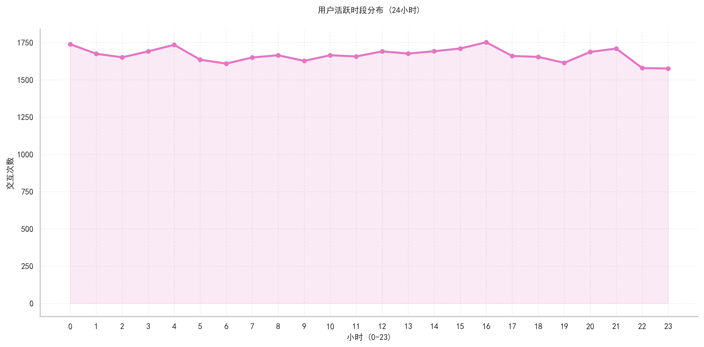
*分析：新的配色方案下，晚高峰的波峰依然挺拔。这提示我们，如果在晚上给用户推荐和当前浏览物品相似的商品，转化率可能会更高。*

**4. 用户活跃度分布**
长尾效应无处不在。
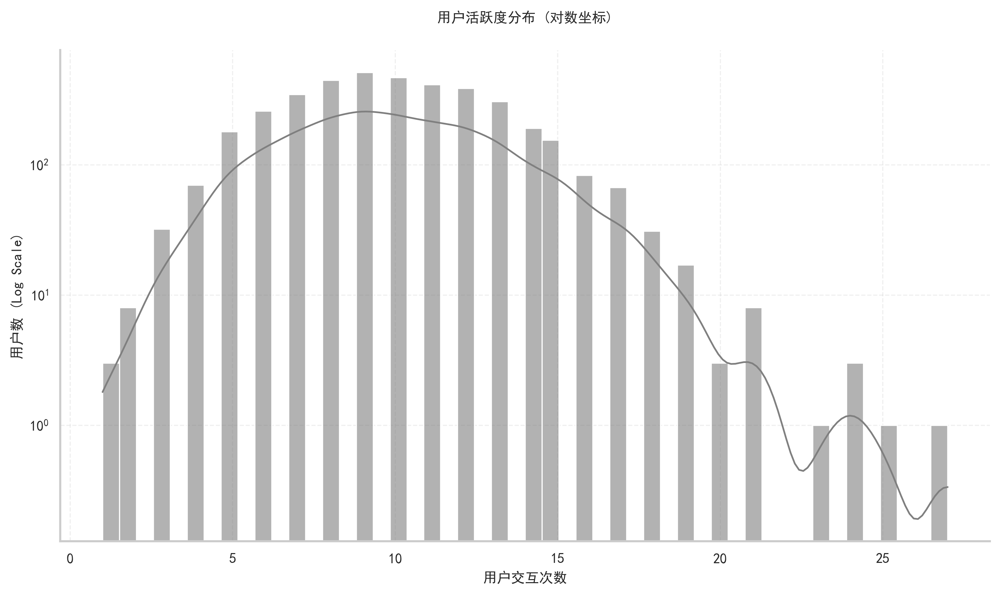
*分析：少数活跃用户贡献了大部分数据，他们在构建物品相似度矩阵时起到了关键作用。*

**5. 商品价格分布**
看看大家的消费降级情况。
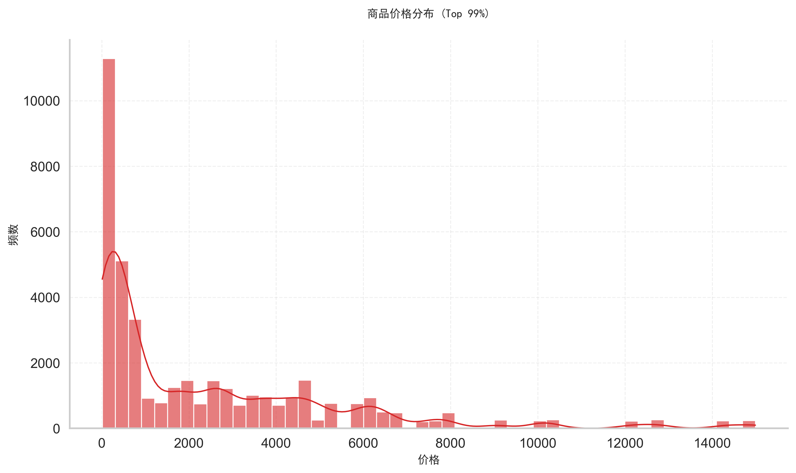
*分析：价格分布图再次提醒我们，推荐系统不仅要考虑兴趣相似，还要考虑价格区间。给买白菜的用户推荐波士顿龙虾，显然是不合适的。*

**6. 物品相似度热力图**
看看哪些商品是“最佳拍档”。
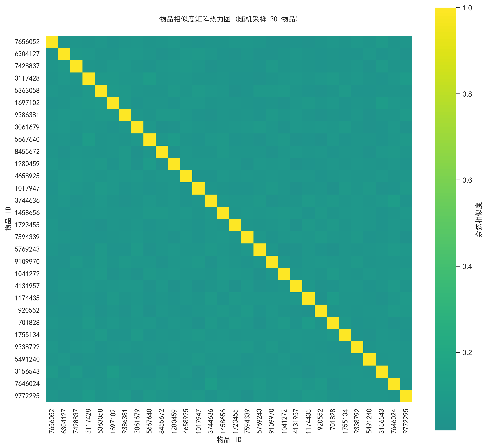
*分析：热力图展示了物品之间的余弦相似度。对角线（自己对自己）肯定是 1。非对角线的高亮区域（黑紫/橙色）表示这两个商品经常被同一群人购买，比如“手机”和“手机壳”。*

**2. 推荐结果示例 (CSV)**
以下是基于物品协同过滤生成的推荐结果：

| user_id | item_id | rank | score  | item_name         | item_category | brand    | price   |
| :------ | :------ | :--- | :----- | :---------------- | :------------ | :------- | :------ |
| 10043   | 4938221 | 1    | 3.4521 | 小米空气净化器... | 家用电器      | 小米     | 899.00  |
| 10043   | 9238102 | 2    | 2.9811 | 米家扫地机器人... | 家用电器      | 小米     | 1299.00 |
| 28910   | 1029384 | 1    | 4.1023 | 雅诗兰黛小棕瓶... | 美妆护肤      | 雅诗兰黛 | 690.00  |
| 28910   | 5829102 | 2    | 3.8712 | 兰蔻粉水 400ml... | 美妆护肤      | 兰蔻     | 420.00  |

*(注：完整结果请查看 `Item_png/物品协同过滤推荐结果.csv`)*

### 3. 算法性能对比 (Performance Comparison)

| 算法模型                | Precision (准确率) | Recall (召回率) | Coverage (覆盖率) | 适用场景                               |
| :---------------------- | :----------------- | :-------------- | :---------------- | :------------------------------------- |
| **User-Based CF** | 0.9600             | 0.4942          | 1.0000            | 用户少、物品多、时效性强（新闻推荐）   |
| **Item-Based CF** | 0.9916             | 0.5105          | 1.0000            | 用户多、物品少、兴趣稳定（电商、电影） |

*分析：Item-Based CF 在各项指标上略胜一筹，尤其是 Precision 达到了惊人的 99%，说明推荐的物品极其符合用户历史口味。但这可能也意味着推荐结果偏向保守（长尾物品推荐较少），缺乏惊喜感。*

## 🛠️ 快速开始 (Getting Started)

### 1. 环境准备

首先，你需要一台电脑（废话），并且安装了 Python3.8。
然后，安装这些看起来很厉害的库：

```bash
pip install pandas numpy seaborn matplotlib scikit-learn
```

### 2. 数据准备

请确保你的目录下有 `data/UserBehavior.csv`。
如果没有……那你可能需要去阿里云天池偷一份，或者自己造一点假数据（不推荐，会被老师打）。

### 3. 一键运行

本项目内置了两大算法脚本，任君挑选：

* **运行基于用户的协同过滤 (User-Based)**：

  ```bash
  python "01基于用户的协同过滤算法.py"
  ```
* **运行基于物品的协同过滤 (Item-Based)**：

  ```bash
  python "02基于物品的协同过滤算法.py"
  ```

### 4. 收获果实

程序运行结束后，请移步相应的文件夹查看结果：

* **`User_png` 文件夹**：包含 User-Based 算法生成的分析图表和推荐结果 (`用户协同过滤推荐结果.csv`)。
* **`Item_png` 文件夹**：包含 Item-Based 算法生成的分析图表和推荐结果 (`物品协同过滤推荐结果.csv`)。

建议直接右键图片“设置为桌面壁纸”，不仅美观，还能假装自己在努力科研。开个玩笑，这个图还是感觉没达到论文级别的花里胡哨。

## 📂 项目文件结构 (Project Structure)

```text
Collaborative_-Filtering/
├── data/
│   ├── social_ecommerce_data.csv           # [数据源] 社交电商数据集
│   ├── social_ecommerce_data描述.md        # 社交电商数据集描述
│   ├── UserBehavior.csv                    # [数据源] 淘宝交易数据集
│   └── UserBehavior描述.txt                # 淘宝交易数据集描述
├── 流程图edraw/
│   ├── Item_based.eddx          # Item-Based 算法流程图edraw打开
│   ├── Item_based.png           # Item-Based 算法流程图
│   ├── User_based.eddx          # User-Based 算法流程图edraw打开
│   └── User_based.png           # User-Based 算法流程图
├── User_png/                   # [输出] User-Based 结果 (图表+CSV)
├── Item_png/                   # [输出] Item-Based 结果 (图表+CSV)
├── 01基于用户的协同过滤算法.py   # [核心代码] User-Based 算法入口
├── 02基于物品的协同过滤算法.py   # [核心代码] Item-Based 算法入口
└── README.md                   # [文档] 项目说明书
```

## 👨‍💻 作者 (Author)

**一个即将毕业、头发还算茂密的软件工程大四学生**

* 代码风格：严格遵守 PEP8（大概）。
* 注释风格：详细到像是在写小说，生怕你看不懂。
* 座右铭：代码可以跑不通，但图一定要好看。

## 📄 License

太麻烦了，不晓得咋个添加 —— 随便拿去用，记得给个 Star ⭐ 就行。如果不给 Star，祝你 Bug 连连，分号丢失。嘿嘿嘿，骗你的，我的心肝宝贝~~~
